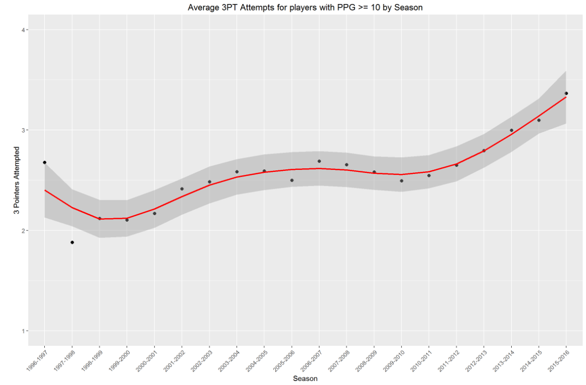
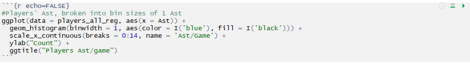

# NBA Scoring

Exploratory Data Analysis of NBA scoring from 1996-2016.

This project uses exploratory data analysis to investigate if and how scoring has changed in the NBA in the twenty seasons from 1996-97 to 2015-16. The project uses many NBA statistics other than scoring to check for correlations and such. The project makes final assessments primarily based on visualizations.

Below is an example of a visualization in this project:

## To Use

To use this project first download the following files:

- players_all_x00.csv
- p4_ODonnell_x05.Rmd

Then, open the R Markdown file p4_ODonnell_x05.Rmd in RStudio.

Last, run each chunk of code in order from first to last. A chunk of code will look like the following:

## Prerequisites

- R
- RStudio

## Author

Michael O'Donnell
mro4354@gmail.com
